Potrzebne biblioteki
====================

``` r
library(keras)
library(jpeg)
```

Importujemy modele.
===================

``` r
model_res <- application_resnet50(weights = 'imagenet') #modele z konkursu
model_vgg16 <- application_vgg16(weights = 'imagenet')
model_vgg19 <- application_vgg19(weights = 'imagenet')
```

Funkcja do plotowania pobranych rysunków.
-----------------------------------------

``` r
plot_img <- function(obraz) {
  img_path <- paste0("obrazy/", obraz)
  plot.new()
  rasterImage(readJPEG(img_path),  0, 0, 1, 1)
}
```

Funkcję, która automatycznie rozpoznaje obraz i podaje wyniki uzyskany przez modele.
------------------------------------------------------------------------------------

``` r
what_is_it <- function(obraz,n=5) {
  img_path <- paste0("obrazy/", obraz)
  img <- image_load(img_path, target_size = c(224,224))
  x <- image_to_array(img)
  
  x <- array_reshape(x, c(1, dim(x)))
  x <- imagenet_preprocess_input(x)
  
  preds <- model_res %>% predict(x)
  cat("ResNet50\n\n")
  print(imagenet_decode_predictions(preds, top = n)[[1]])
  
  cat("\n\n")
  
  preds <- model_vgg16 %>% predict(x)
  cat("VGG16\n\n")
  print(imagenet_decode_predictions(preds, top = n)[[1]])
  
  cat("\n\n")
  
  preds <- model_vgg19 %>% predict(x)
  cat("VGG19\n\n")
  print(imagenet_decode_predictions(preds, top = n)[[1]])
}
```

Użyłem zdjęć które akurat mam zapisane na komputerze. Starałem się
wybrać specjalnie takie zdjęcia, które modele może rozpozna.

“Tygrys” - Andy Worhol.
=======================

Zwierzę nie zostało rozpoznane, najwidoczniej ten obraz jest na swój
sposób zbyt abstrakcyjny.

``` r
plot_img('2.jpeg')
```

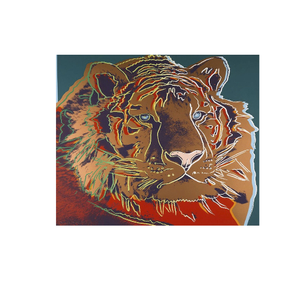

``` r
what_is_it('2.jpeg',3)
```

    ## ResNet50
    ## 
    ##   class_name class_description      score
    ## 1  n03724870              mask 0.44941467
    ## 2  n03249569              drum 0.08402407
    ## 3  n04192698            shield 0.07900365
    ## 
    ## 
    ## VGG16
    ## 
    ##   class_name class_description      score
    ## 1  n04192698            shield 0.09989087
    ## 2  n04522168              vase 0.09825062
    ## 3  n03063599        coffee_mug 0.04439355
    ## 
    ## 
    ## VGG19
    ## 
    ##   class_name class_description      score
    ## 1  n04192698            shield 0.08880865
    ## 2  n04522168              vase 0.05861242
    ## 3  n02910353            buckle 0.04523376

“3 krzyże” - zdjęcie autorstwa Andy’ego Worhola .
=================================================

Tu tez model daje nam wyniki nie pewne i raczej nie adekwatne. Z
pewniejszych mamy gwóźdź, kopertę, zegar. Z mających jakichś sens jest
ołtarz, ale ma jedynie score = 0.1. taki sam wynik mają światła uliczne.

``` r
plot_img('3.jpeg')
```

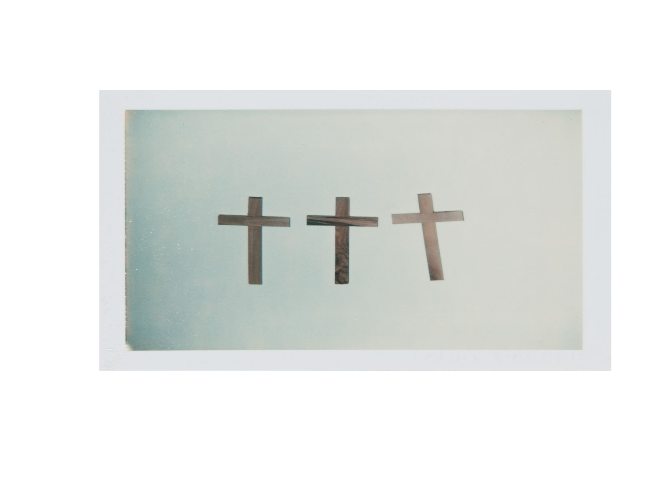

``` r
what_is_it('3.jpeg',4)
```

    ## ResNet50
    ## 
    ##   class_name class_description      score
    ## 1  n04548280        wall_clock 0.18670860
    ## 2  n02699494             altar 0.10069993
    ## 3  n06874185     traffic_light 0.09749167
    ## 4  n03998194        prayer_rug 0.09195612
    ## 
    ## 
    ## VGG16
    ## 
    ##   class_name class_description      score
    ## 1  n03804744              nail 0.18007764
    ## 2  n03291819          envelope 0.07592065
    ## 3  n04548280        wall_clock 0.06813763
    ## 4  n07248320       book_jacket 0.04944785
    ## 
    ## 
    ## VGG19
    ## 
    ##   class_name class_description      score
    ## 1  n03804744              nail 0.35801905
    ## 2  n03291819          envelope 0.10643652
    ## 3  n03041632           cleaver 0.03697248
    ## 4  n03498962           hatchet 0.03248440

Zdjęcia czaszek
===============

Tu spodziewałem się jakiegoś sensownego wyniku. Najwidoczniej nie ma
kategorii typu czaszka/kości. Mamy: maskę, triceratopsa, hipopotama,
muszlę

``` r
plot_img('6.jpg')
```

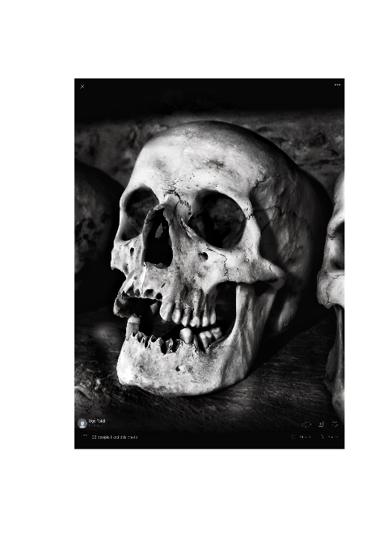

``` r
what_is_it('6.jpg',4)
```

    ## ResNet50
    ## 
    ##   class_name class_description       score
    ## 1  n03724870              mask 0.848836124
    ## 2  n01704323       triceratops 0.109410793
    ## 3  n01943899             conch 0.010573359
    ## 4  n03388043          fountain 0.003492411
    ## 
    ## 
    ## VGG16
    ## 
    ##   class_name class_description      score
    ## 1  n01943899             conch 0.31512806
    ## 2  n02398521      hippopotamus 0.21885042
    ## 3  n01704323       triceratops 0.10978002
    ## 4  n03724870              mask 0.04939686
    ## 
    ## 
    ## VGG19
    ## 
    ##   class_name class_description      score
    ## 1  n01943899             conch 0.42874461
    ## 2  n01704323       triceratops 0.32503241
    ## 3  n03724870              mask 0.01828329
    ## 4  n02110341         dalmatian 0.01728901

``` r
plot_img('5.jpeg')
```

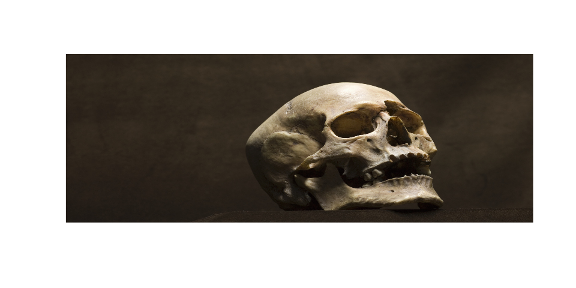

``` r
what_is_it('5.jpeg',4)
```

    ## ResNet50
    ## 
    ##   class_name class_description      score
    ## 1  n01704323       triceratops 0.66892046
    ## 2  n03724870              mask 0.10389724
    ## 3  n02395406               hog 0.03716694
    ## 4  n01871265            tusker 0.02089941
    ## 
    ## 
    ## VGG16
    ## 
    ##   class_name class_description      score
    ## 1  n02447366            badger 0.09340165
    ## 2  n01748264      Indian_cobra 0.09206503
    ## 3  n13040303         stinkhorn 0.06898924
    ## 4  n02415577           bighorn 0.06746583
    ## 
    ## 
    ## VGG19
    ## 
    ##   class_name           class_description      score
    ## 1  n02088238                      basset 0.12963785
    ## 2  n03743016                    megalith 0.10288966
    ## 3  n02100236 German_short-haired_pointer 0.08933358
    ## 4  n02088632                    bluetick 0.07484871

Obraz łódki
===========

Kolejny obraz tym razem pomimo pewnego poziomu abstrakcji udało się
modelom rozpoznać łódkę. Choć 2 z modeli klasyfikują ją jako wrak.

``` r
plot_img('7.jpg')
```

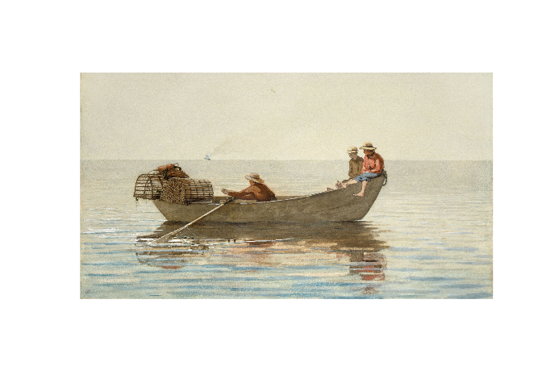

``` r
what_is_it('7.jpg')
```

    ## ResNet50
    ## 
    ##   class_name class_description      score
    ## 1  n04606251             wreck 0.50756419
    ## 2  n03447447           gondola 0.18805397
    ## 3  n02951358             canoe 0.10990557
    ## 4  n03873416            paddle 0.05025375
    ## 5  n01498041          stingray 0.01574951
    ## 
    ## 
    ## VGG16
    ## 
    ##   class_name class_description       score
    ## 1  n04606251             wreck 0.922342598
    ## 2  n02951358             canoe 0.021291759
    ## 3  n03447447           gondola 0.021095062
    ## 4  n03873416            paddle 0.010799774
    ## 5  n03947888            pirate 0.003793182
    ## 
    ## 
    ## VGG19
    ## 
    ##   class_name class_description      score
    ## 1  n03447447           gondola 0.61423272
    ## 2  n03873416            paddle 0.12657157
    ## 3  n02951358             canoe 0.12574644
    ## 4  n04606251             wreck 0.05483563
    ## 5  n04347754         submarine 0.01953840

Zdjęcie kota
============

Tutaj jako, że mamy zdjęcie zwierzęcia to poradził sobie dobrze.
Poprawnie też zaklasyfikował rasę.

``` r
plot_img('8.jpg')
```

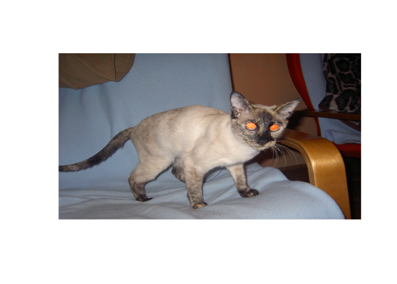

``` r
what_is_it('8.jpg')
```

    ## ResNet50
    ## 
    ##   class_name class_description        score
    ## 1  n02123597       Siamese_cat 0.9944683313
    ## 2  n02124075      Egyptian_cat 0.0038369833
    ## 3  n02127052              lynx 0.0003174354
    ## 4  n04265275      space_heater 0.0001853825
    ## 5  n03887697       paper_towel 0.0001048127
    ## 
    ## 
    ## VGG16
    ## 
    ##   class_name  class_description       score
    ## 1  n02123597        Siamese_cat 0.957894862
    ## 2  n02124075       Egyptian_cat 0.013326641
    ## 3  n02091467 Norwegian_elkhound 0.010017936
    ## 4  n02127052               lynx 0.004295040
    ## 5  n02104365         schipperke 0.003103527
    ## 
    ## 
    ## VGG19
    ## 
    ##   class_name  class_description       score
    ## 1  n02123597        Siamese_cat 0.856924534
    ## 2  n02124075       Egyptian_cat 0.047059707
    ## 3  n02127052               lynx 0.035420708
    ## 4  n04265275       space_heater 0.010406610
    ## 5  n02091467 Norwegian_elkhound 0.007348414

Zdjęcie ręki
============

Jedno zdjęcie mojej ręki i drugie lepiej wyeksponowane. Jak widać oba
źle zaklasyfikowane.

``` r
plot_img('9.jpg')
```

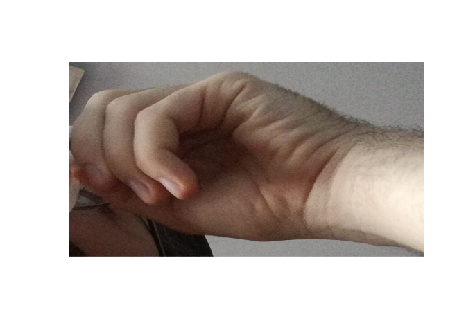

``` r
what_is_it('9.jpg')
```

    ## ResNet50
    ## 
    ##   class_name class_description      score
    ## 1  n02786058          Band_Aid 0.10499439
    ## 2  n03085013 computer_keyboard 0.03806188
    ## 3  n04372370            switch 0.02732531
    ## 4  n03804744              nail 0.02462534
    ## 5  n03937543       pill_bottle 0.02395504
    ## 
    ## 
    ## VGG16
    ## 
    ##   class_name   class_description      score
    ## 1  n02123597         Siamese_cat 0.07616912
    ## 2  n02443484 black-footed_ferret 0.05281087
    ## 3  n03188531              diaper 0.03371193
    ## 4  n02108915      French_bulldog 0.03262693
    ## 5  n02364673          guinea_pig 0.03035467
    ## 
    ## 
    ## VGG19
    ## 
    ##   class_name class_description      score
    ## 1  n02786058          Band_Aid 0.19901666
    ## 2  n03188531            diaper 0.04057379
    ## 3  n15075141     toilet_tissue 0.03436757
    ## 4  n03887697       paper_towel 0.03072196
    ## 5  n03825788            nipple 0.02303490

``` r
plot_img('hand.jpeg')
```

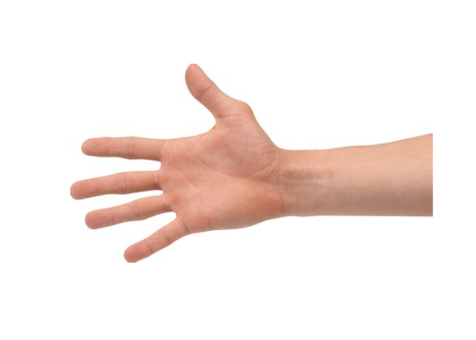

``` r
what_is_it('hand.jpeg')
```

    ## ResNet50
    ## 
    ##   class_name class_description      score
    ## 1  n02786058          Band_Aid 0.12205970
    ## 2  n02951585        can_opener 0.09360551
    ## 3  n04357314         sunscreen 0.05273188
    ## 4  n03876231        paintbrush 0.04377431
    ## 5  n04118776              rule 0.03611134
    ## 
    ## 
    ## VGG16
    ## 
    ##   class_name class_description      score
    ## 1  n02951585        can_opener 0.16363066
    ## 2  n02786058          Band_Aid 0.06926748
    ## 3  n03935335        piggy_bank 0.05141151
    ## 4  n04357314         sunscreen 0.03837197
    ## 5  n03876231        paintbrush 0.03771670
    ## 
    ## 
    ## VGG19
    ## 
    ##   class_name class_description      score
    ## 1  n02951585        can_opener 0.10530355
    ## 2  n03255030          dumbbell 0.10238248
    ## 3  n02786058          Band_Aid 0.10219256
    ## 4  n03804744              nail 0.07120511
    ## 5  n03481172            hammer 0.04246261

Zdjęcie szympansa
=================

2 modele nie słusznie klasyfikują bardziej jako goryla.

``` r
plot_img('10.jpeg')
```

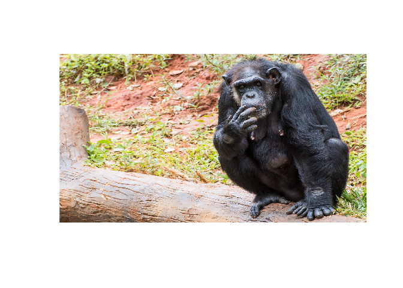

``` r
what_is_it('10.jpeg')
```

    ## ResNet50
    ## 
    ##   class_name class_description       score
    ## 1  n02480855           gorilla 0.790869117
    ## 2  n02481823        chimpanzee 0.075572461
    ## 3  n02492660     howler_monkey 0.065349638
    ## 4  n01688243    frilled_lizard 0.008603136
    ## 5  n02483708           siamang 0.008166263
    ## 
    ## 
    ## VGG16
    ## 
    ##   class_name   class_description      score
    ## 1  n02480855             gorilla 0.45563412
    ## 2  n02481823          chimpanzee 0.36622998
    ## 3  n02483708             siamang 0.05447859
    ## 4  n02133161 American_black_bear 0.03650714
    ## 5  n02492660       howler_monkey 0.03270785
    ## 
    ## 
    ## VGG19
    ## 
    ##   class_name class_description       score
    ## 1  n02481823        chimpanzee 0.666312814
    ## 2  n02480855           gorilla 0.162429020
    ## 3  n02483708           siamang 0.131579682
    ## 4  n02493793     spider_monkey 0.021770868
    ## 5  n02492660     howler_monkey 0.008632749

Zdjęcie pomnika
===============

O dziwo model rozpoznał że na zdjęciu jest rzeźba. Mamy wśród wyników
piedestał, obelisk, megalit. Jeden rozpoznał materiał: miedź.

``` r
plot_img('11.jpg')
```

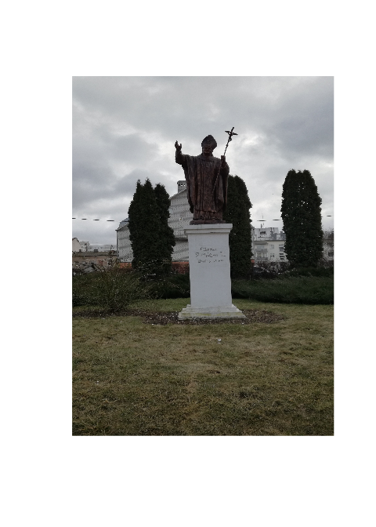

``` r
what_is_it('11.jpg')
```

    ## ResNet50
    ## 
    ##   class_name class_description      score
    ## 1  n03903868          pedestal 0.79254013
    ## 2  n02892201             brass 0.07897896
    ## 3  n04486054    triumphal_arch 0.04248532
    ## 4  n03837869           obelisk 0.02953168
    ## 5  n02747177            ashcan 0.01614135
    ## 
    ## 
    ## VGG16
    ## 
    ##   class_name class_description      score
    ## 1  n03903868          pedestal 0.42331406
    ## 2  n03837869           obelisk 0.21745521
    ## 3  n04346328             stupa 0.06972346
    ## 4  n03743016          megalith 0.05373014
    ## 5  n04486054    triumphal_arch 0.02554311
    ## 
    ## 
    ## VGG19
    ## 
    ##   class_name class_description      score
    ## 1  n03837869           obelisk 0.27158356
    ## 2  n03743016          megalith 0.15461192
    ## 3  n03903868          pedestal 0.14220390
    ## 4  n04486054    triumphal_arch 0.04620933
    ## 5  n04346328             stupa 0.03491951

Baton
=====

Tu ku mojemu zaskoczeniu 3 model bardzo jest pewny że na zdjęciu
znajduje się harmonijka.

``` r
plot_img('13.jpg')
```

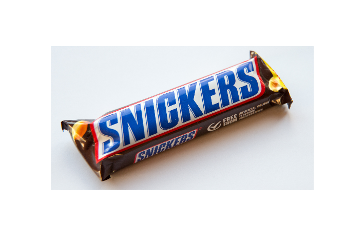

``` r
what_is_it('13.jpg')
```

    ## ResNet50
    ## 
    ##   class_name class_description      score
    ## 1  n03871628            packet 0.25860724
    ## 2  n03908618        pencil_box 0.16058408
    ## 3  n06794110       street_sign 0.11610079
    ## 4  n04548362            wallet 0.04848527
    ## 5  n02840245            binder 0.04121584
    ## 
    ## 
    ## VGG16
    ## 
    ##   class_name class_description      score
    ## 1  n03494278         harmonica 0.39240646
    ## 2  n03871628            packet 0.20743132
    ## 3  n04548362            wallet 0.10290398
    ## 4  n06794110       street_sign 0.06403392
    ## 5  n07248320       book_jacket 0.03200327
    ## 
    ## 
    ## VGG19
    ## 
    ##   class_name class_description      score
    ## 1  n03494278         harmonica 0.83302629
    ## 2  n03908618        pencil_box 0.03172375
    ## 3  n04548362            wallet 0.02809962
    ## 4  n02877765         bottlecap 0.02366120
    ## 5  n03871628            packet 0.02038583
