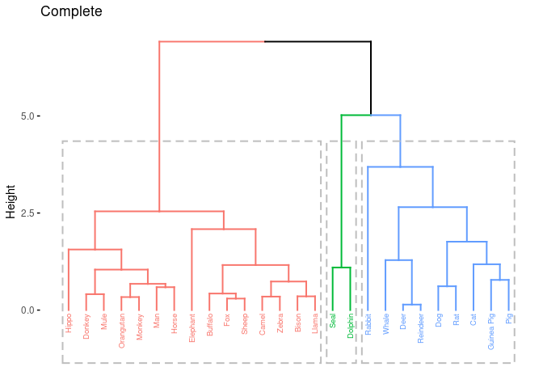
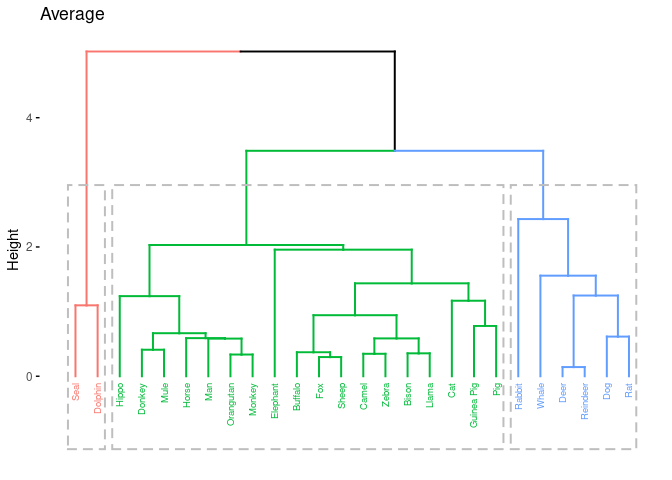
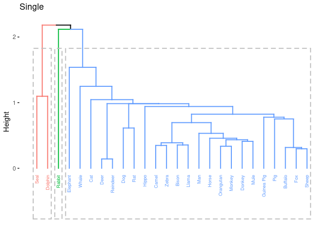

-   [Potrzebne biblioteki](#potrzebne-biblioteki)
-   [Zbiór danych](#zbiór-danych)
    -   [Uzyjemy zbioru danych mleka różnych
        ssaków.](#uzyjemy-zbioru-danych-mleka-różnych-ssaków.)
-   [Dodajmy do ramki danych poniższe dane mleka
    ludzkiego.](#dodajmy-do-ramki-danych-poniższe-dane-mleka-ludzkiego.)
-   [Ze względu na grupowanie i łatwiejszy odczyt późniejszych wyników
    użyjemy kolumny `name` jako klucza
    głównego.](#ze-względu-na-grupowanie-i-łatwiejszy-odczyt-późniejszych-wyników-użyjemy-kolumny-name-jako-klucza-głównego.)
-   [Wstępne przeskalowanie danych:](#wstępne-przeskalowanie-danych)
-   [Grupowanie metodą *k*-średnich](#grupowanie-metodą-k-średnich)
    -   [Wyznaczamy podział na 3 klastry z pomocą algorytmy
        k-średnich.](#wyznaczamy-podział-na-3-klastry-z-pomocą-algorytmy-k-średnich.)
    -   [Czy nasz podział ma sens?](#czy-nasz-podział-ma-sens)
-   [Grupowanie hierarchiczne](#grupowanie-hierarchiczne)
    -   [Zastosujemy teraz metodę klastrowania hierarchicznego z
        łączeniami *complete*, *average* i
        *single*.](#zastosujemy-teraz-metodę-klastrowania-hierarchicznego-z-łączeniami-complete-average-i-single.)
-   [Wnioski](#wnioski)
    -   [Jeżeli zadamy sobie pytanie: Do kogo w tym zbiorze danych
        najbardziej podobny jest człowiek? To najłatiwej chyba spojrzeć
        na macierz odległości, z użyciem metryki
        euklidesowej.](#jeżeli-zadamy-sobie-pytanie-do-kogo-w-tym-zbiorze-danych-najbardziej-podobny-jest-człowiek-to-najłatiwej-chyba-spojrzeć-na-macierz-odległości-z-użyciem-metryki-euklidesowej.)
    -   [Podobnie możemy odczytać, że 2 najbardziej do siebie zblizone
        gatunki to sarna i
        renifer.](#podobnie-możemy-odczytać-że-2-najbardziej-do-siebie-zblizone-gatunki-to-sarna-i-renifer.)
    -   [Z dendrogramu można wyczytać dosyć nieintuicyjne podobieństwa
        składu
        mleka.](#z-dendrogramu-można-wyczytać-dosyć-nieintuicyjne-podobieństwa-składu-mleka.)

### Potrzebne biblioteki

``` r
library(cluster.datasets)
library(tidyverse)
library(tidymodels)
library("cluster")
library("factoextra")
```

### Zbiór danych

##### Uzyjemy zbioru danych mleka różnych ssaków.

Ładowanie i wyswietlanie zbiór danych `all.mammals.milk.1956`. Dane
zawierają wartości procentowe. Np mleko końskie ma 90.1% wody oraz 1%
tłuszczu.

``` r
data(all.mammals.milk.1956)
all.mammals.milk.1956
```

<script data-pagedtable-source type="application/json">
{"columns":[{"label":["name"],"name":[1],"type":["chr"],"align":["left"]},{"label":["water"],"name":[2],"type":["dbl"],"align":["right"]},{"label":["protein"],"name":[3],"type":["dbl"],"align":["right"]},{"label":["fat"],"name":[4],"type":["dbl"],"align":["right"]},{"label":["lactose"],"name":[5],"type":["dbl"],"align":["right"]},{"label":["ash"],"name":[6],"type":["dbl"],"align":["right"]}],"data":[{"1":"Horse","2":"90.1","3":"2.6","4":"1.0","5":"6.9","6":"0.35"},{"1":"Orangutan","2":"88.5","3":"1.4","4":"3.5","5":"6.0","6":"0.24"},{"1":"Monkey","2":"88.4","3":"2.2","4":"2.7","5":"6.4","6":"0.18"},{"1":"Donkey","2":"90.3","3":"1.7","4":"1.4","5":"6.2","6":"0.40"},{"1":"Hippo","2":"90.4","3":"0.6","4":"4.5","5":"4.4","6":"0.10"},{"1":"Camel","2":"87.7","3":"3.5","4":"3.4","5":"4.8","6":"0.71"},{"1":"Bison","2":"86.9","3":"4.8","4":"1.7","5":"5.7","6":"0.90"},{"1":"Buffalo","2":"82.1","3":"5.9","4":"7.9","5":"4.7","6":"0.78"},{"1":"Guinea Pig","2":"81.9","3":"7.4","4":"7.2","5":"2.7","6":"0.85"},{"1":"Cat","2":"81.6","3":"10.1","4":"6.3","5":"4.4","6":"0.75"},{"1":"Fox","2":"81.6","3":"6.6","4":"5.9","5":"4.9","6":"0.93"},{"1":"Llama","2":"86.5","3":"3.9","4":"3.2","5":"5.6","6":"0.80"},{"1":"Mule","2":"90.0","3":"2.0","4":"1.8","5":"5.5","6":"0.47"},{"1":"Pig","2":"82.8","3":"7.1","4":"5.1","5":"3.7","6":"1.10"},{"1":"Zebra","2":"86.2","3":"3.0","4":"4.8","5":"5.3","6":"0.70"},{"1":"Sheep","2":"82.0","3":"5.6","4":"6.4","5":"4.7","6":"0.91"},{"1":"Dog","2":"76.3","3":"9.3","4":"9.5","5":"3.0","6":"1.20"},{"1":"Elephant","2":"70.7","3":"3.6","4":"17.6","5":"5.6","6":"0.63"},{"1":"Rabbit","2":"71.3","3":"12.3","4":"13.1","5":"1.9","6":"2.30"},{"1":"Rat","2":"72.5","3":"9.2","4":"12.6","5":"3.3","6":"1.40"},{"1":"Deer","2":"65.9","3":"10.4","4":"19.7","5":"2.6","6":"1.40"},{"1":"Reindeer","2":"64.8","3":"10.7","4":"20.3","5":"2.5","6":"1.40"},{"1":"Whale","2":"64.8","3":"11.1","4":"21.2","5":"1.6","6":"0.85"},{"1":"Seal","2":"46.4","3":"9.7","4":"42.0","5":"0.0","6":"0.85"},{"1":"Dolphin","2":"44.9","3":"10.6","4":"34.9","5":"0.9","6":"0.53"}],"options":{"columns":{"min":{},"max":[10]},"rows":{"min":[10],"max":[10]},"pages":{}}}
  </script>

### Dodajmy do ramki danych poniższe dane mleka ludzkiego.

``` r
Man <- data.frame(
  name = "Man",
  water = 88.1,
  protein = 0.85,
  fat = 0.4,
  lactose = 7.0,
  ash = 0.2
)
mammals <- rbind(Man, all.mammals.milk.1956)
mammals
```

<script data-pagedtable-source type="application/json">
{"columns":[{"label":["name"],"name":[1],"type":["fct"],"align":["left"]},{"label":["water"],"name":[2],"type":["dbl"],"align":["right"]},{"label":["protein"],"name":[3],"type":["dbl"],"align":["right"]},{"label":["fat"],"name":[4],"type":["dbl"],"align":["right"]},{"label":["lactose"],"name":[5],"type":["dbl"],"align":["right"]},{"label":["ash"],"name":[6],"type":["dbl"],"align":["right"]}],"data":[{"1":"Man","2":"88.1","3":"0.85","4":"0.4","5":"7.0","6":"0.20"},{"1":"Horse","2":"90.1","3":"2.60","4":"1.0","5":"6.9","6":"0.35"},{"1":"Orangutan","2":"88.5","3":"1.40","4":"3.5","5":"6.0","6":"0.24"},{"1":"Monkey","2":"88.4","3":"2.20","4":"2.7","5":"6.4","6":"0.18"},{"1":"Donkey","2":"90.3","3":"1.70","4":"1.4","5":"6.2","6":"0.40"},{"1":"Hippo","2":"90.4","3":"0.60","4":"4.5","5":"4.4","6":"0.10"},{"1":"Camel","2":"87.7","3":"3.50","4":"3.4","5":"4.8","6":"0.71"},{"1":"Bison","2":"86.9","3":"4.80","4":"1.7","5":"5.7","6":"0.90"},{"1":"Buffalo","2":"82.1","3":"5.90","4":"7.9","5":"4.7","6":"0.78"},{"1":"Guinea Pig","2":"81.9","3":"7.40","4":"7.2","5":"2.7","6":"0.85"},{"1":"Cat","2":"81.6","3":"10.10","4":"6.3","5":"4.4","6":"0.75"},{"1":"Fox","2":"81.6","3":"6.60","4":"5.9","5":"4.9","6":"0.93"},{"1":"Llama","2":"86.5","3":"3.90","4":"3.2","5":"5.6","6":"0.80"},{"1":"Mule","2":"90.0","3":"2.00","4":"1.8","5":"5.5","6":"0.47"},{"1":"Pig","2":"82.8","3":"7.10","4":"5.1","5":"3.7","6":"1.10"},{"1":"Zebra","2":"86.2","3":"3.00","4":"4.8","5":"5.3","6":"0.70"},{"1":"Sheep","2":"82.0","3":"5.60","4":"6.4","5":"4.7","6":"0.91"},{"1":"Dog","2":"76.3","3":"9.30","4":"9.5","5":"3.0","6":"1.20"},{"1":"Elephant","2":"70.7","3":"3.60","4":"17.6","5":"5.6","6":"0.63"},{"1":"Rabbit","2":"71.3","3":"12.30","4":"13.1","5":"1.9","6":"2.30"},{"1":"Rat","2":"72.5","3":"9.20","4":"12.6","5":"3.3","6":"1.40"},{"1":"Deer","2":"65.9","3":"10.40","4":"19.7","5":"2.6","6":"1.40"},{"1":"Reindeer","2":"64.8","3":"10.70","4":"20.3","5":"2.5","6":"1.40"},{"1":"Whale","2":"64.8","3":"11.10","4":"21.2","5":"1.6","6":"0.85"},{"1":"Seal","2":"46.4","3":"9.70","4":"42.0","5":"0.0","6":"0.85"},{"1":"Dolphin","2":"44.9","3":"10.60","4":"34.9","5":"0.9","6":"0.53"}],"options":{"columns":{"min":{},"max":[10]},"rows":{"min":[10],"max":[10]},"pages":{}}}
  </script>

### Ze względu na grupowanie i łatwiejszy odczyt późniejszych wyników użyjemy kolumny `name` jako klucza głównego.

``` r
ssaki <- mammals
rownames(ssaki) <- ssaki$name
ssaki <- ssaki %>% select(-name)
ssaki %>% head(5)
```

<script data-pagedtable-source type="application/json">
{"columns":[{"label":[""],"name":["_rn_"],"type":[""],"align":["left"]},{"label":["water"],"name":[1],"type":["dbl"],"align":["right"]},{"label":["protein"],"name":[2],"type":["dbl"],"align":["right"]},{"label":["fat"],"name":[3],"type":["dbl"],"align":["right"]},{"label":["lactose"],"name":[4],"type":["dbl"],"align":["right"]},{"label":["ash"],"name":[5],"type":["dbl"],"align":["right"]}],"data":[{"1":"88.1","2":"0.85","3":"0.4","4":"7.0","5":"0.20","_rn_":"Man"},{"1":"90.1","2":"2.60","3":"1.0","4":"6.9","5":"0.35","_rn_":"Horse"},{"1":"88.5","2":"1.40","3":"3.5","4":"6.0","5":"0.24","_rn_":"Orangutan"},{"1":"88.4","2":"2.20","3":"2.7","4":"6.4","5":"0.18","_rn_":"Monkey"},{"1":"90.3","2":"1.70","3":"1.4","4":"6.2","5":"0.40","_rn_":"Donkey"}],"options":{"columns":{"min":{},"max":[10]},"rows":{"min":[10],"max":[10]},"pages":{}}}
  </script>

### Wstępne przeskalowanie danych:

``` r
ssaki_scaled <- ssaki %>% scale()
ssaki_scaled
```

    ##                 water     protein         fat    lactose         ash
    ## Man         0.7502485 -1.38222561 -0.90844383  1.4661653 -1.25953683
    ## Horse       0.9076221 -0.91306287 -0.85123057  1.4129989 -0.94725497
    ## Orangutan   0.7817232 -1.23477446 -0.61284200  0.9345015 -1.17626167
    ## Monkey      0.7738546 -1.02030007 -0.68912634  1.1471670 -1.30117441
    ## Donkey      0.9233595 -1.15434657 -0.81308840  1.0408342 -0.84316102
    ## Hippo       0.9312282 -1.44924886 -0.51748657  0.0838393 -1.46772473
    ## Camel       0.7187738 -0.67177918 -0.62237754  0.2965048 -0.19777851
    ## Bison       0.6558243 -0.32325828 -0.78448177  0.7750023  0.19777851
    ## Buffalo     0.2781276 -0.02835599 -0.19327812  0.2433385 -0.05204698
    ## Guinea Pig  0.2623903  0.37378350 -0.26002692 -0.8199893  0.09368456
    ## Cat         0.2387842  1.09763459 -0.34584680  0.0838393 -0.11450335
    ## Fox         0.2387842  0.15930911 -0.38398897  0.3496712  0.26023488
    ## Llama       0.6243496 -0.56454198 -0.64144863  0.7218359 -0.01040940
    ## Mule        0.8997535 -1.07391867 -0.77494623  0.6686695 -0.69742948
    ## Pig         0.3332084  0.29335560 -0.46027332 -0.2883254  0.61415432
    ## Zebra       0.6007436 -0.80582567 -0.48887995  0.5623368 -0.21859730
    ## Sheep       0.2702589 -0.10878389 -0.33631126  0.2433385  0.21859730
    ## Dog        -0.1782559  0.88316019 -0.04070943 -0.6604901  0.82234223
    ## Elephant   -0.6189021 -0.64496988  0.73166954  0.7218359 -0.36432883
    ## Rabbit     -0.5716900  1.68743917  0.30257011 -1.2453203  3.11240919
    ## Rat        -0.4772658  0.85635089  0.25489239 -0.5009909  1.23871804
    ## Deer       -0.9965988  1.17806249  0.93191593 -0.8731556  1.23871804
    ## Reindeer   -1.0831543  1.25849038  0.98912919 -0.9263220  1.23871804
    ## Whale      -1.0831543  1.36572758  1.07494908 -1.4048195  0.09368456
    ## Seal       -2.5309917  0.99039739  3.05834198 -2.2554817  0.09368456
    ## Dolphin    -2.6490219  1.23168108  2.38131844 -1.7769842 -0.57251674
    ## attr(,"scaled:center")
    ##     water   protein       fat   lactose       ash 
    ## 78.565385  6.005769  9.926923  4.242308  0.805000 
    ## attr(,"scaled:scale")
    ##      water    protein        fat    lactose        ash 
    ## 12.7086094  3.7300490 10.4870800  1.8808877  0.4803353

Grupowanie metodą *k*-średnich
------------------------------

##### Wyznaczamy podział na 3 klastry z pomocą algorytmy k-średnich.

``` r
set.seed(1234)
klastry_k_means <- ssaki_scaled %>%
  kmeans(centers = 3, iter.max = 100, nstart = 25)
```

### Czy nasz podział ma sens?

Najmniejszy klaster to nr 3 jest w nim tylko foka i delfin. Widać że
proporcje się u nich znacząco różnią. Posiadają bardzo mało wody i dużo
tłuszczu. Jeżeli spojrzymy na oryginalne dane to jest to poniżej 50%
wody i powyżej 30% tłuszczu. Różnice między klastrem 1 i 2 są bardziej
subtelnę to ciężko ocenić. Na pewno 1 posiadają więcej białka oraz
posiadają średnio mniej wody i laktozy.

``` r
ssaki_scaled_z_klastrem <- klastry_k_means %>%
  augment(ssaki_scaled)

ssaki_scaled_z_klastrem %>%
  count(.cluster)
```

<script data-pagedtable-source type="application/json">
{"columns":[{"label":[".cluster"],"name":[1],"type":["fct"],"align":["left"]},{"label":["n"],"name":[2],"type":["int"],"align":["right"]}],"data":[{"1":"1","2":"9"},{"1":"2","2":"15"},{"1":"3","2":"2"}],"options":{"columns":{"min":{},"max":[10]},"rows":{"min":[10],"max":[10]},"pages":{}}}
  </script>

``` r
ssaki_scaled_z_klastrem %>%
  filter(.cluster == 1)
```

<script data-pagedtable-source type="application/json">
{"columns":[{"label":[".rownames"],"name":[1],"type":["chr"],"align":["left"]},{"label":["water"],"name":[2],"type":["dbl"],"align":["right"]},{"label":["protein"],"name":[3],"type":["dbl"],"align":["right"]},{"label":["fat"],"name":[4],"type":["dbl"],"align":["right"]},{"label":["lactose"],"name":[5],"type":["dbl"],"align":["right"]},{"label":["ash"],"name":[6],"type":["dbl"],"align":["right"]},{"label":[".cluster"],"name":[7],"type":["fct"],"align":["left"]}],"data":[{"1":"Guinea Pig","2":"0.2623903","3":"0.3737835","4":"-0.26002692","5":"-0.8199893","6":"0.09368456","7":"1"},{"1":"Cat","2":"0.2387842","3":"1.0976346","4":"-0.34584680","5":"0.0838393","6":"-0.11450335","7":"1"},{"1":"Pig","2":"0.3332084","3":"0.2933556","4":"-0.46027332","5":"-0.2883254","6":"0.61415432","7":"1"},{"1":"Dog","2":"-0.1782559","3":"0.8831602","4":"-0.04070943","5":"-0.6604901","6":"0.82234223","7":"1"},{"1":"Rabbit","2":"-0.5716900","3":"1.6874392","4":"0.30257011","5":"-1.2453203","6":"3.11240919","7":"1"},{"1":"Rat","2":"-0.4772658","3":"0.8563509","4":"0.25489239","5":"-0.5009909","6":"1.23871804","7":"1"},{"1":"Deer","2":"-0.9965988","3":"1.1780625","4":"0.93191593","5":"-0.8731556","6":"1.23871804","7":"1"},{"1":"Reindeer","2":"-1.0831543","3":"1.2584904","4":"0.98912919","5":"-0.9263220","6":"1.23871804","7":"1"},{"1":"Whale","2":"-1.0831543","3":"1.3657276","4":"1.07494908","5":"-1.4048195","6":"0.09368456","7":"1"}],"options":{"columns":{"min":{},"max":[10]},"rows":{"min":[10],"max":[10]},"pages":{}}}
  </script>

``` r
ssaki_scaled_z_klastrem %>%
  filter(.cluster == 2)
```

<script data-pagedtable-source type="application/json">
{"columns":[{"label":[".rownames"],"name":[1],"type":["chr"],"align":["left"]},{"label":["water"],"name":[2],"type":["dbl"],"align":["right"]},{"label":["protein"],"name":[3],"type":["dbl"],"align":["right"]},{"label":["fat"],"name":[4],"type":["dbl"],"align":["right"]},{"label":["lactose"],"name":[5],"type":["dbl"],"align":["right"]},{"label":["ash"],"name":[6],"type":["dbl"],"align":["right"]},{"label":[".cluster"],"name":[7],"type":["fct"],"align":["left"]}],"data":[{"1":"Man","2":"0.7502485","3":"-1.38222561","4":"-0.9084438","5":"1.4661653","6":"-1.25953683","7":"2"},{"1":"Horse","2":"0.9076221","3":"-0.91306287","4":"-0.8512306","5":"1.4129989","6":"-0.94725497","7":"2"},{"1":"Orangutan","2":"0.7817232","3":"-1.23477446","4":"-0.6128420","5":"0.9345015","6":"-1.17626167","7":"2"},{"1":"Monkey","2":"0.7738546","3":"-1.02030007","4":"-0.6891263","5":"1.1471670","6":"-1.30117441","7":"2"},{"1":"Donkey","2":"0.9233595","3":"-1.15434657","4":"-0.8130884","5":"1.0408342","6":"-0.84316102","7":"2"},{"1":"Hippo","2":"0.9312282","3":"-1.44924886","4":"-0.5174866","5":"0.0838393","6":"-1.46772473","7":"2"},{"1":"Camel","2":"0.7187738","3":"-0.67177918","4":"-0.6223775","5":"0.2965048","6":"-0.19777851","7":"2"},{"1":"Bison","2":"0.6558243","3":"-0.32325828","4":"-0.7844818","5":"0.7750023","6":"0.19777851","7":"2"},{"1":"Buffalo","2":"0.2781276","3":"-0.02835599","4":"-0.1932781","5":"0.2433385","6":"-0.05204698","7":"2"},{"1":"Fox","2":"0.2387842","3":"0.15930911","4":"-0.3839890","5":"0.3496712","6":"0.26023488","7":"2"},{"1":"Llama","2":"0.6243496","3":"-0.56454198","4":"-0.6414486","5":"0.7218359","6":"-0.01040940","7":"2"},{"1":"Mule","2":"0.8997535","3":"-1.07391867","4":"-0.7749462","5":"0.6686695","6":"-0.69742948","7":"2"},{"1":"Zebra","2":"0.6007436","3":"-0.80582567","4":"-0.4888799","5":"0.5623368","6":"-0.21859730","7":"2"},{"1":"Sheep","2":"0.2702589","3":"-0.10878389","4":"-0.3363113","5":"0.2433385","6":"0.21859730","7":"2"},{"1":"Elephant","2":"-0.6189021","3":"-0.64496988","4":"0.7316695","5":"0.7218359","6":"-0.36432883","7":"2"}],"options":{"columns":{"min":{},"max":[10]},"rows":{"min":[10],"max":[10]},"pages":{}}}
  </script>

``` r
ssaki_scaled_z_klastrem %>%
  filter(.cluster == 3)
```

<script data-pagedtable-source type="application/json">
{"columns":[{"label":[".rownames"],"name":[1],"type":["chr"],"align":["left"]},{"label":["water"],"name":[2],"type":["dbl"],"align":["right"]},{"label":["protein"],"name":[3],"type":["dbl"],"align":["right"]},{"label":["fat"],"name":[4],"type":["dbl"],"align":["right"]},{"label":["lactose"],"name":[5],"type":["dbl"],"align":["right"]},{"label":["ash"],"name":[6],"type":["dbl"],"align":["right"]},{"label":[".cluster"],"name":[7],"type":["fct"],"align":["left"]}],"data":[{"1":"Seal","2":"-2.530992","3":"0.9903974","4":"3.058342","5":"-2.255482","6":"0.09368456","7":"3"},{"1":"Dolphin","2":"-2.649022","3":"1.2316811","4":"2.381318","5":"-1.776984","6":"-0.57251674","7":"3"}],"options":{"columns":{"min":{},"max":[10]},"rows":{"min":[10],"max":[10]},"pages":{}}}
  </script>

``` r
mammals %>%
  filter(name == "Dolphin" | name == "Seal")
```

<script data-pagedtable-source type="application/json">
{"columns":[{"label":["name"],"name":[1],"type":["fct"],"align":["left"]},{"label":["water"],"name":[2],"type":["dbl"],"align":["right"]},{"label":["protein"],"name":[3],"type":["dbl"],"align":["right"]},{"label":["fat"],"name":[4],"type":["dbl"],"align":["right"]},{"label":["lactose"],"name":[5],"type":["dbl"],"align":["right"]},{"label":["ash"],"name":[6],"type":["dbl"],"align":["right"]}],"data":[{"1":"Seal","2":"46.4","3":"9.7","4":"42.0","5":"0.0","6":"0.85"},{"1":"Dolphin","2":"44.9","3":"10.6","4":"34.9","5":"0.9","6":"0.53"}],"options":{"columns":{"min":{},"max":[10]},"rows":{"min":[10],"max":[10]},"pages":{}}}
  </script>

Grupowanie hierarchiczne
------------------------

##### Zastosujemy teraz metodę klastrowania hierarchicznego z łączeniami *complete*, *average* i *single*.

``` r
# maciez odległosci
res.dist <- dist(ssaki_scaled, method = "euclidean")
as.matrix(res.dist)[1:6, 1:6]
```

    ##                 Man     Horse Orangutan    Monkey    Donkey     Hippo
    ## Man       0.0000000 0.5903390 0.6322295 0.5321101 0.6672813 1.4643295
    ## Horse     0.5903390 0.0000000 0.6764480 0.5015944 0.4574521 1.5610868
    ## Orangutan 0.6322295 0.6764480 0.0000000 0.3357236 0.4346157 0.9412866
    ## Monkey    0.5321101 0.5015944 0.3357236 0.0000000 0.5260891 1.1817904
    ## Donkey    0.6672813 0.4574521 0.4346157 0.5260891 0.0000000 1.2166877
    ## Hippo     1.4643295 1.5610868 0.9412866 1.1817904 1.2166877 0.0000000

``` r
model_complete <- hclust(d = res.dist, method = "complete")
model_average <- hclust(d = res.dist, method = "average")
model_single <- hclust(d = res.dist, method = "single")
```

``` r
fviz_dend(model_complete,
  k = 3, # liczba grup
  cex = 0.5, # rozmiar etykiet
  # k_colors = c("#2E9FDF", "#00AFBB", "#E7B800",),
  color_labels_by_k = TRUE,
  rect = TRUE,
  main = "Complete"
)
```

    ## Warning: `guides(<scale> = FALSE)` is deprecated. Please use `guides(<scale> =
    ## "none")` instead.



``` r
fviz_dend(model_average,
  k = 3, # liczba grup
  cex = 0.5, # rozmiar etykiet
  # k_colors = c("#2E9FDF", "#00AFBB", "#E7B800",),
  color_labels_by_k = TRUE,
  rect = TRUE,
  main = "Average"
)
```

    ## Warning: `guides(<scale> = FALSE)` is deprecated. Please use `guides(<scale> =
    ## "none")` instead.



``` r
fviz_dend(model_single,
  k = 3, # liczba grup
  cex = 0.5, # rozmiar etykiet
  # k_colors = c("#2E9FDF", "#00AFBB", "#E7B800",),
  color_labels_by_k = TRUE,
  rect = TRUE,
  main = "Single"
)
```

    ## Warning: `guides(<scale> = FALSE)` is deprecated. Please use `guides(<scale> =
    ## "none")` instead.



Wnioski
-------

Jak widać grupa nr 3 się ostała jest na tyle charakterystyczna że jest
wykrywana w każdym przypadku. O pozostałych ciężko powiedzieć to samo.

##### Jeżeli zadamy sobie pytanie: Do kogo w tym zbiorze danych najbardziej podobny jest człowiek? To najłatiwej chyba spojrzeć na macierz odległości, z użyciem metryki euklidesowej.

Najbardziej podobnym do człowieka(poza samym człowiekiem) na tym zbiorze
danych jest jest małpa.

``` r
as.matrix(res.dist)[1, ] %>% sort()
```

    ##        Man     Monkey      Horse  Orangutan     Donkey       Mule      Hippo 
    ##  0.0000000  0.5321101  0.5903390  0.6322295  0.6672813  1.0426844  1.4643295 
    ##      Zebra      Llama      Camel      Bison    Buffalo      Sheep   Elephant 
    ##  1.5591933  1.6941337  1.7558460  1.9357605  2.3496086  2.4206540  2.5423443 
    ##        Fox        Pig        Cat Guinea Pig        Dog        Rat       Deer 
    ##  2.5434707  3.1259091  3.1543216  3.2862941  3.9501823  4.2405599  4.9706312 
    ##      Whale   Reindeer     Rabbit    Dolphin       Seal 
    ##  4.9920158  5.0892832  6.2532379  6.3403548  6.9147040

##### Podobnie możemy odczytać, że 2 najbardziej do siebie zblizone gatunki to sarna i renifer.

``` r
min_dist <- min(res.dist) # res.dist nie ma przękątnych więc minimum bedize poprzwne
distance_matrix <- as.matrix(res.dist) # mapujemy do macierzy żeby móć uzyć funkcji which, res.dist jest klasy dist która nie ma wielu funkcji szukania
which(distance_matrix == min_dist, arr.ind = TRUE)
```

    ##          row col
    ## Reindeer  23  22
    ## Deer      22  23

``` r
min_dist
```

    ## [1] 0.1416352

##### Z dendrogramu można wyczytać dosyć nieintuicyjne podobieństwa składu mleka.

Tak jak podejrzewamy podobieństwo foka jest podobna do delfina(ssaki
wodne). Zaskakują gatunki podobne do człowieka (gałąź po lewej), poza
małpą i orangutanem pojawiają się tam o dziwo: hipopotam, koń, muł i
osioł. W szczególności koń który jest prawie tak samo podobny do
człowieka jak małpa.

``` r
fviz_dend(model_complete,
  k = 3, # liczba grup
  cex = 0.5, # rozmiar etykiet
  # k_colors = c("#2E9FDF", "#00AFBB", "#E7B800",),
  color_labels_by_k = TRUE,
  rect = TRUE,
  main = "Complete"
)
```

    ## Warning: `guides(<scale> = FALSE)` is deprecated. Please use `guides(<scale> =
    ## "none")` instead.


