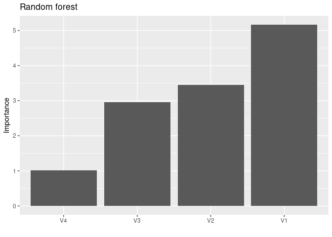
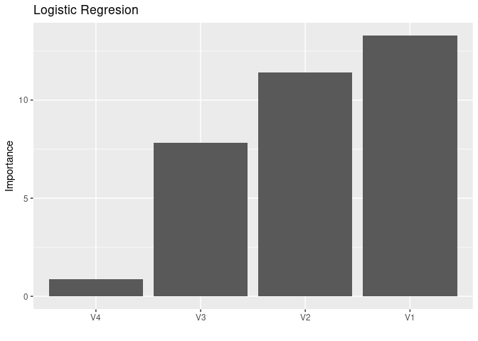

Ładowanie bibliotek
===================

``` r
library(tidyverse)
library(randomForest)
library(tidymodels)
library(vip)
```

Zbiór danych
============

Uzyjemy zbioru danych `banknote_authentication.csv`. Z jego opisem
możesz zapoznać się [na tej stronie](https://www.openml.org/d/1462).

``` r
banknoty <- read_csv("banknote_authentication.csv")
banknoty$Class <- factor(banknoty$Class)
is.factor(banknoty$Class)
```

    ## [1] TRUE

Zmienna Class przechowuje informacje o autentycznośći banknotu. Zgodnie
z dokumentacją: “1” to banknot autentyczny, “2” to banknot fałszywy.
Zobaczmy jaki jest stosunek tych 2 klas w naszym zbiorze.

``` r
banknoty %>% count(Class)
```

| Class |    n|
|:------|----:|
| 1     |  762|
| 2     |  610|

Zamieńmy tą zmienną na coś bardziej czytelnego:

``` r
banknoty$Class <- factor(banknoty$Class, labels = c("True", "Fake"))
head(banknoty)
```

|       V1|       V2|       V3|        V4| Class |
|--------:|--------:|--------:|---------:|:------|
|  3.62160|   8.6661|  -2.8073|  -0.44699| True  |
|  4.54590|   8.1674|  -2.4586|  -1.46210| True  |
|  3.86600|  -2.6383|   1.9242|   0.10645| True  |
|  3.45660|   9.5228|  -4.0112|  -3.59440| True  |
|  0.32924|  -4.4552|   4.5718|  -0.98880| True  |
|  4.36840|   9.6718|  -3.9606|  -3.16250| True  |

Podzielmy zbiór na treningowy i testowy w stosunku 60/40 z zachowaniem
proporcji zmiennej Class, którą będziemy chcieli przewidywać.

``` r
set.seed(1234)
banknoty_split <- initial_split(banknoty, strata = Class, prop = 0.6)
banknoty_train <- training(banknoty_split)
banknoty_test <- testing(banknoty_split)
# sprawdzenie:
banknoty_test %>% count(Class)
```

| Class |    n|
|:------|----:|
| True  |  305|
| Fake  |  244|

``` r
banknoty_train %>% count(Class)
```

| Class |    n|
|:------|----:|
| True  |  457|
| Fake  |  366|

``` r
count(banknoty_test) / (count(banknoty_train) + count(banknoty_test))
```

|          n|
|----------:|
|  0.4001458|

``` r
count(banknoty_train) / (count(banknoty_train) + count(banknoty_test))
```

|          n|
|----------:|
|  0.5998542|

Lasy losowe
===========

Zróbmy klasyfikacje przy użyciu lasu losowego dla wszystkich
predykatorów.

``` r
set.seed(1234)
model_rf <- randomForest(Class ~ ., banknoty_train)
model_rf
```

    ## 
    ## Call:
    ##  randomForest(formula = Class ~ ., data = banknoty_train) 
    ##                Type of random forest: classification
    ##                      Number of trees: 500
    ## No. of variables tried at each split: 2
    ## 
    ##         OOB estimate of  error rate: 0.61%
    ## Confusion matrix:
    ##      True Fake class.error
    ## True  454    3 0.006564551
    ## Fake    2  364 0.005464481

Dokładność modelu
-----------------

“OOB estimate of error rate: 0.61%” - błąd klasyfikacji wynosi 0.61% a
więc dokładność która wynosi 100%-błąd = 99.39. Możemy też policzyć z
macierzy pomyłek: (TP+TN)/n Dokładność:

``` r
(model_rf$confusion[1, 1] + model_rf$confusion[2, 2]) / count(banknoty_train)
```

|          n|
|----------:|
|  0.9939247|

Dokładność na zbiorze testowym:
-------------------------------

Predykcja:

``` r
pred_rf <- predict(model_rf, banknoty_test)
# pred_rf %>% head()
```

Macierz pomyłek:
----------------

``` r
conf_rf <- table(prognoza = pred_rf, prawda = banknoty_test$Class)
conf_rf
```

    ##         prawda
    ## prognoza True Fake
    ##     True  299    4
    ##     Fake    6  240

Dokładność predykcji na zbiorze testowym:
-----------------------------------------

``` r
# dokładność:
acc_rf <- (conf_rf[1, 1] + conf_rf[2, 2]) / count(banknoty_test)
acc_rf
```

|          n|
|----------:|
|  0.9817851|

Regresja logistyczna
====================

Dla tych samych danych spróbujmy zrobić regresję logistyczną. Przyjmijmy
punkt odcięcia *p* = 0.5. Tak jak poprzednio używamy wszystkich
dostepnych zmiennych

``` r
model_glm <- glm(Class ~ ., data = banknoty_train, family = "binomial")
summary(model_glm)
```

    ## 
    ## Call:
    ## glm(formula = Class ~ ., family = "binomial", data = banknoty_train)
    ## 
    ## Deviance Residuals: 
    ##      Min        1Q    Median        3Q       Max  
    ## -1.46334   0.00000   0.00000   0.00005   2.13468  
    ## 
    ## Coefficients:
    ##             Estimate Std. Error z value Pr(>|z|)    
    ## (Intercept)   8.2120     2.4499   3.352 0.000802 ***
    ## V1           -9.9580     3.1360  -3.175 0.001496 ** 
    ## V2           -5.0979     1.6235  -3.140 0.001689 ** 
    ## V3           -6.4289     2.0361  -3.157 0.001591 ** 
    ## V4           -0.8512     0.5922  -1.437 0.150603    
    ## ---
    ## Signif. codes:  0 '***' 0.001 '**' 0.01 '*' 0.05 '.' 0.1 ' ' 1
    ## 
    ## (Dispersion parameter for binomial family taken to be 1)
    ## 
    ##     Null deviance: 1130.84  on 822  degrees of freedom
    ## Residual deviance:   22.17  on 818  degrees of freedom
    ## AIC: 32.17
    ## 
    ## Number of Fisher Scoring iterations: 13

``` r
# bierzemy
banknoty_test_prob <- predict(model_glm,
  newdata = banknoty_test,
  type = "response"
)
```

Macierz pomyłek:
----------------

``` r
banknoty_test_prob <- ifelse(banknoty_test_prob > 0.5, "Fake", "True")
conf_glm <- table(pred = banknoty_test_prob, actual = banknoty_test$Class)
conf_glm
```

    ##       actual
    ## pred   True Fake
    ##   Fake    2  240
    ##   True  303    4

Dokładność:
-----------

``` r
acc_glm <- (conf_glm[1, 2] + conf_glm[2, 1]) / count(banknoty_test)
acc_glm
```

|         n|
|---------:|
|  0.989071|

Podsumowanie
============

Jak widać model regresji logistycznej wypada trochę lepiej pod względem
dokładności

``` r
acc_glm - acc_rf
```

|         n|
|---------:|
|  0.007286|

Jak widzimy w tabeli niżej 533 wyników jest zgodna, oraz jedynie 16
predykcji się różni

``` r
test_with_pred <- banknoty_test
test_with_pred$glm <- banknoty_test_prob
test_with_pred$rf <- pred_rf
test_with_pred$pred <- ifelse(test_with_pred$glm == test_with_pred$rf, "Same", "Different")
test_with_pred %>% count(pred, glm, rf)
```

| pred      | glm  | rf   |    n|
|:----------|:-----|:-----|----:|
| Different | Fake | True |    6|
| Different | True | Fake |   10|
| Same      | Fake | Fake |  236|
| Same      | True | True |  297|

``` r
test_with_pred %>% count(pred)
```

| pred      |    n|
|:----------|----:|
| Different |   16|
| Same      |  533|

Czułość i swoistość dla obu modeli (na zbiorze testowym)
--------------------------------------------------------

Z macierzy pomyłek liczymy precyzję w rzeczywistych klasach. Czyli tutaj
precyzję na banknotach fałszywych -czułość. Precyzje na banknotach
prawdziwych - swoistość (Bo naszym pozytywnym wynikiem będzie
znalezienie banknotu fałszywego). Mamy trochę pomieszane kolejności w
tabelkach więc trzeba uważać na indeksy. Widzimy że czułośc jest
identyczna, ale swoistość jest lepsza w modelu logistycznym.

``` r
conf_rf
```

    ##         prawda
    ## prognoza True Fake
    ##     True  299    4
    ##     Fake    6  240

``` r
czulosc_rf <- conf_rf[2, 2] / (conf_rf[1, 2] + conf_rf[2, 2])
czulosc_rf
```

    ## [1] 0.9836066

``` r
swoistosc_rf <- conf_rf[1, 1] / (conf_rf[2, 1] + conf_rf[1, 1])
swoistosc_rf
```

    ## [1] 0.9803279

``` r
conf_glm
```

    ##       actual
    ## pred   True Fake
    ##   Fake    2  240
    ##   True  303    4

``` r
czulosc_glm <- conf_glm[1, 2] / (conf_glm[1, 2] + conf_glm[2, 2])
czulosc_glm
```

    ## [1] 0.9836066

``` r
swoistosc_glm <- conf_glm[2, 1] / (conf_glm[2, 1] + conf_glm[1, 1])
swoistosc_glm
```

    ## [1] 0.9934426

Istotność zmiennych
-------------------

Patrząc na oba wykresy widzimy że proporcje są inne. Dla obu modeli
kolejność istotności jest taka sama. Różnica jest na zmiennych V4 i V2.
Dla lasu istotniejsza jest zmienna V4 niż w modelu logistycznym. Z kolei
w logistycznym zmienna V2 jest istotniejsza niż w drugim modelu.

``` r
# method
# "model" - model specific VI - więc otrzymamy różne dla obu modeli metody
# "firm" - variance based - na podstawie variancji
# "permute" - perutation
# "shap" - shapley

model_rf %>% vip(horiz = FALSE, method = "firm") + ggtitle("Random forest")
```



``` r
model_glm %>% vip(horiz = FALSE, method = "firm") + ggtitle("Logistic Regresion")
```



Który z modeli?
---------------

Patrząc na precyzję obu modeli, na danych które posiadamy. Powinniśmy
wybrać model regresji logistycznej. Nie mamy tutaj dylematu czy chcemy
bardziej czuły lub swoisty model. Regresja logistyczna ma tutaj lepszą
swoistość, a czułość jest identyczna.

Gdyby róznica istniała, to myślę, że podczas prowadzenia sklepu błędne
zaklasyfikowanie prawdziwego banknotu jako fałszywego raczej nas nie
bedzie kosztować, bo możemy poprosić klienta o inny i do transakcji i
tak dojdzie. Jeżeli natomiast zaklasyfikujemy fałszywy jako prawdziwy to
tracimy pieniądze o równowartości tego banknotu. Tak więc przypadek
False Negative jest dla nas bardzo kosztowny (bo u nas przypadek
pozytywny to banknot fałszywy). Więc w tym problemie czułość jest
znacznie istotniejsza i na nią powinniśmy zwrócić uwagę w pierwszej
kolejnośći.
