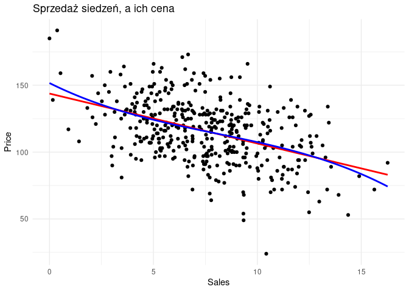
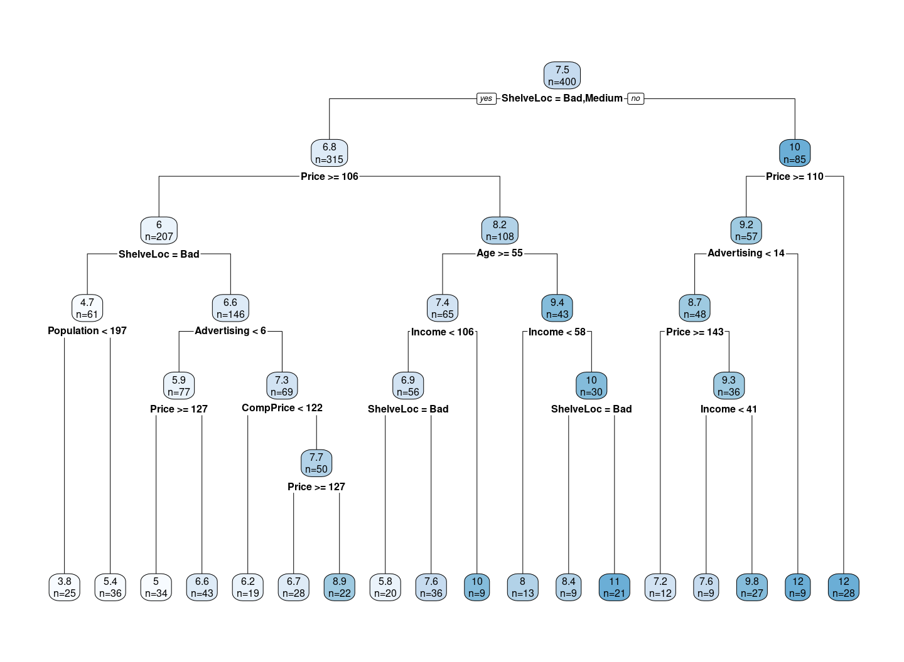

Potrzebne biblioteki
====================

``` r
library(tidyverse)
library(ISLR)
library(rpart)
library(rpart.plot)
```

Zbiór danych
============

Użyjemy zbioru danych o siedzeniach samochodów. Dokonany analizy ich cen
i wyników sprzedaży.

``` r
Carseats %>% head()
```

<table>
<colgroup>
<col style="width: 6%" />
<col style="width: 11%" />
<col style="width: 8%" />
<col style="width: 13%" />
<col style="width: 12%" />
<col style="width: 6%" />
<col style="width: 11%" />
<col style="width: 4%" />
<col style="width: 11%" />
<col style="width: 6%" />
<col style="width: 4%" />
</colgroup>
<thead>
<tr class="header">
<th style="text-align: right;">Sales</th>
<th style="text-align: right;">CompPrice</th>
<th style="text-align: right;">Income</th>
<th style="text-align: right;">Advertising</th>
<th style="text-align: right;">Population</th>
<th style="text-align: right;">Price</th>
<th style="text-align: left;">ShelveLoc</th>
<th style="text-align: right;">Age</th>
<th style="text-align: right;">Education</th>
<th style="text-align: left;">Urban</th>
<th style="text-align: left;">US</th>
</tr>
</thead>
<tbody>
<tr class="odd">
<td style="text-align: right;">9.50</td>
<td style="text-align: right;">138</td>
<td style="text-align: right;">73</td>
<td style="text-align: right;">11</td>
<td style="text-align: right;">276</td>
<td style="text-align: right;">120</td>
<td style="text-align: left;">Bad</td>
<td style="text-align: right;">42</td>
<td style="text-align: right;">17</td>
<td style="text-align: left;">Yes</td>
<td style="text-align: left;">Yes</td>
</tr>
<tr class="even">
<td style="text-align: right;">11.22</td>
<td style="text-align: right;">111</td>
<td style="text-align: right;">48</td>
<td style="text-align: right;">16</td>
<td style="text-align: right;">260</td>
<td style="text-align: right;">83</td>
<td style="text-align: left;">Good</td>
<td style="text-align: right;">65</td>
<td style="text-align: right;">10</td>
<td style="text-align: left;">Yes</td>
<td style="text-align: left;">Yes</td>
</tr>
<tr class="odd">
<td style="text-align: right;">10.06</td>
<td style="text-align: right;">113</td>
<td style="text-align: right;">35</td>
<td style="text-align: right;">10</td>
<td style="text-align: right;">269</td>
<td style="text-align: right;">80</td>
<td style="text-align: left;">Medium</td>
<td style="text-align: right;">59</td>
<td style="text-align: right;">12</td>
<td style="text-align: left;">Yes</td>
<td style="text-align: left;">Yes</td>
</tr>
<tr class="even">
<td style="text-align: right;">7.40</td>
<td style="text-align: right;">117</td>
<td style="text-align: right;">100</td>
<td style="text-align: right;">4</td>
<td style="text-align: right;">466</td>
<td style="text-align: right;">97</td>
<td style="text-align: left;">Medium</td>
<td style="text-align: right;">55</td>
<td style="text-align: right;">14</td>
<td style="text-align: left;">Yes</td>
<td style="text-align: left;">Yes</td>
</tr>
<tr class="odd">
<td style="text-align: right;">4.15</td>
<td style="text-align: right;">141</td>
<td style="text-align: right;">64</td>
<td style="text-align: right;">3</td>
<td style="text-align: right;">340</td>
<td style="text-align: right;">128</td>
<td style="text-align: left;">Bad</td>
<td style="text-align: right;">38</td>
<td style="text-align: right;">13</td>
<td style="text-align: left;">Yes</td>
<td style="text-align: left;">No</td>
</tr>
<tr class="even">
<td style="text-align: right;">10.81</td>
<td style="text-align: right;">124</td>
<td style="text-align: right;">113</td>
<td style="text-align: right;">13</td>
<td style="text-align: right;">501</td>
<td style="text-align: right;">72</td>
<td style="text-align: left;">Bad</td>
<td style="text-align: right;">78</td>
<td style="text-align: right;">16</td>
<td style="text-align: left;">No</td>
<td style="text-align: left;">Yes</td>
</tr>
</tbody>
</table>

Regresja liniowa
================

Sprawdźmy na początek jaki wpływ na sprzedarz siedzeń ma ich cena. Na
wykresie mamy regresję liniową i sześcienną.

``` r
Carseats %>%
  ggplot(aes(x = Sales, y = Price)) +
  geom_point() +
  geom_smooth(method = "lm",
              se = FALSE,
              formula = y ~ x,
              color = "red") +
  geom_smooth(method = "lm",
              se = FALSE,
              formula = y ~ poly(x, degree = 3),
              color = "blue") +
  theme_minimal() +
  ggtitle("Sprzedaż siedzeń, a ich cena")
```



Zobaczmy teraz jaki wpływ ma reszta zmiennych:

Jak widzimy współczynnik
*R*<sup>2</sup> = 0.8734

``` r
model_lm <-
  lm(Sales ~ ., data = Carseats)
summary(model_lm)
```

    ## 
    ## Call:
    ## lm(formula = Sales ~ ., data = Carseats)
    ## 
    ## Residuals:
    ##     Min      1Q  Median      3Q     Max 
    ## -2.8692 -0.6908  0.0211  0.6636  3.4115 
    ## 
    ## Coefficients:
    ##                   Estimate Std. Error t value Pr(>|t|)    
    ## (Intercept)      5.6606231  0.6034487   9.380  < 2e-16 ***
    ## CompPrice        0.0928153  0.0041477  22.378  < 2e-16 ***
    ## Income           0.0158028  0.0018451   8.565 2.58e-16 ***
    ## Advertising      0.1230951  0.0111237  11.066  < 2e-16 ***
    ## Population       0.0002079  0.0003705   0.561    0.575    
    ## Price           -0.0953579  0.0026711 -35.700  < 2e-16 ***
    ## ShelveLocGood    4.8501827  0.1531100  31.678  < 2e-16 ***
    ## ShelveLocMedium  1.9567148  0.1261056  15.516  < 2e-16 ***
    ## Age             -0.0460452  0.0031817 -14.472  < 2e-16 ***
    ## Education       -0.0211018  0.0197205  -1.070    0.285    
    ## UrbanYes         0.1228864  0.1129761   1.088    0.277    
    ## USYes           -0.1840928  0.1498423  -1.229    0.220    
    ## ---
    ## Signif. codes:  0 '***' 0.001 '**' 0.01 '*' 0.05 '.' 0.1 ' ' 1
    ## 
    ## Residual standard error: 1.019 on 388 degrees of freedom
    ## Multiple R-squared:  0.8734, Adjusted R-squared:  0.8698 
    ## F-statistic: 243.4 on 11 and 388 DF,  p-value: < 2.2e-16

Ciekawą w tym zbiorze danych jest zmienna `ShelveLocGood`. Współczynnik
ten mówi nam że jednostkowa zmiana `ShelveLocGood` prowadzi do zmiany
`Sales` o współczynnik(tutaj \~ 4.85). Należy jednak zauważyć że zmienna
ShelveLocGood to zmienna pomocnicza powstała przez mapowanie zmiennej
kategorycznej jaką jest `ShelveLoc` do 2 zmiennych numerycznych
`ShelveLocGood` oraz `ShelveLocMedium`. Jeżeli `ShelveLocGood` = 1 to
oznacza po prostu żę `ShelveLoc` = “Good”.

Czyli jeżeli `ShelveLoc` = “Good” to nasza sprzedaż będzie większa o
4850 sprzedanych siedzeń niż jeśli `ShelveLoc` = “Bad” lub “Medium”.

Wyznaczmy MSE, modelu (na całym zbiorze):

``` r
mean(model_lm$residuals^2)
```

    ## [1] 1.007084

Drzewo regresyjne
=================

Wyrysujmy drzewo regresji dla tych danych, dla zmiennej szukanej:
`Sales` Widać że na diagramie drzewa, nie zostały użyte zmienne:
Education, Urban oraz US.

``` r
model_tree <- rpart(Sales ~ ., data = Carseats)
rpart.plot(model_tree,
  extra = 1
)
```



``` r
model_tree$variable.importance
```

    ##   ShelveLoc       Price   CompPrice      Income Advertising         Age 
    ##  1018.66354   669.21727   217.76769   186.26616   185.98776   153.01500 
    ##  Population   Education          US 
    ##   104.83730    54.84991    52.20836
