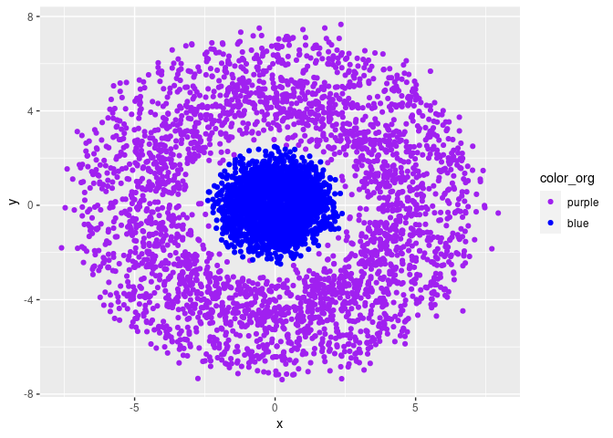
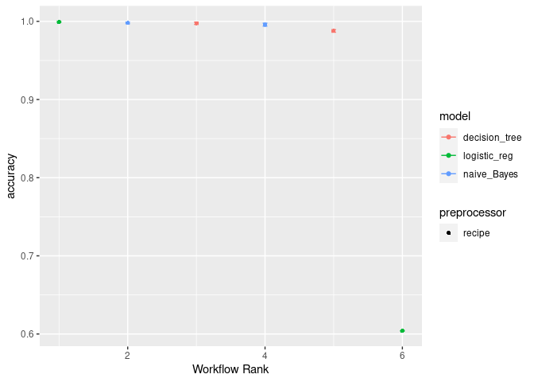
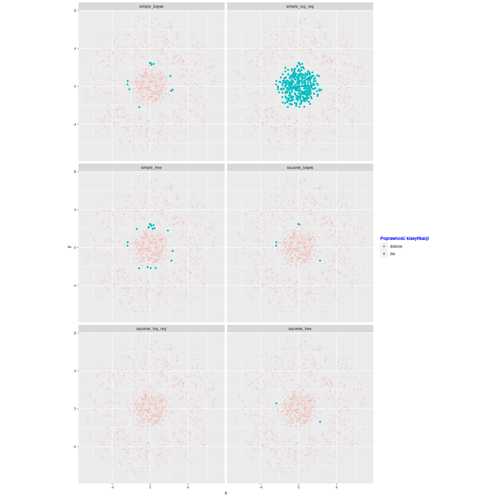

Możemy użyć `workflowsets` aby połączyć w jeden strumień wiele modeli.

Potrzebne biblioteki
====================

``` r
library(tidyverse)
library(tidymodels)
library(discrim)
library(dplyr)
```

Generowanie danych
==================

Tworzymy prosty zbiór danych wielu pierścieni losowo wygenerowanych
punktów, które kolorujemy ze wzlgędu na odległość od punktu (0,0).

``` r
n_in_circ <- 1000
angle_1 <- runif(n = n_in_circ, min = 0, max = 2 * pi)
radius_1 <- rnorm(n = n_in_circ, mean = 1, sd = 0.5)

angle_2 <- runif(n = n_in_circ, min = 0, max = 2 * pi)
radius_2 <- rnorm(n = n_in_circ, mean = 1.5, sd = 0.5)

angle_3 <- runif(n = n_in_circ, min = 0, max = 2 * pi)
radius_3 <- rnorm(n = n_in_circ, mean = 5, sd = 0.5)

angle_4 <- runif(n = n_in_circ, min = 0, max = 2 * pi)
radius_4 <- rnorm(n = n_in_circ, mean = 4, sd = 0.5)

angle_5 <- runif(n = n_in_circ, min = 0, max = 2 * pi)
radius_5 <- rnorm(n = n_in_circ, mean = 6.5, sd = 0.5)

angle <- c(angle_1, angle_2, angle_3, angle_4, angle_4)
radius <- c(radius_1, radius_2, radius_3, radius_4, radius_5)
raw_data <- data.frame(angle, radius)

colors <- c("purple", "blue")
raw_data <- raw_data %>%
  mutate(x = cos(angle) * radius,
          y = sin(angle) * radius,
          color_org = ifelse(radius > 2.5,
          colors[1], colors[2])) %>%
  dplyr::select(-c(angle, radius))
```

Na plaszczyźnie ten zbiór danych wygląda następująco.

``` r
ggplot(raw_data, aes(x, y, colour = color_org)) +
  geom_point() +
  scale_color_manual(values = colors, breaks = colors)
```



Przygotowanie danych i workflow
===============================

Dzielimy zbiór na treningowy i testowy.

``` r
set.seed(1234)
data_split <- initial_split(raw_data, prop = 0.8, strata = "color_org")

data_train <- training(data_split)
data_test <- testing(data_split)
```

Tworzymy recepty. Pierwsza podstawowa, normalizuje zmienne. Druga dodaje
zmienną *x*<sup>2</sup> + *y*<sup>2</sup>.

``` r
rec_base <- recipe(color_org ~ ., data = data_train) %>%
  step_normalize(all_numeric_predictors())

rec_with_squares <- rec_base %>%
  step_mutate(x2_y2 = x * x + y * y)
```

Definiujemy paramtery modeli. Użyjemy w tym projekcie drzewa
decyzyjnego, regresji logistycznej oraz klasyfikatora bayesowskiego.

``` r
color_tree <- decision_tree(
  cost_complexity = 0.1,
  tree_depth = 20,
  min_n = 1
) %>%
  set_engine("rpart") %>%
  set_mode("classification")

color_log_reg <- logistic_reg(mixture = 0.5) %>%
  set_engine("glm") %>%
  set_mode("classification")

color_bayes <- naive_Bayes() %>%
  set_engine("klaR") %>%
  set_mode("classification")
```

Tworzymy workflow z powyższych modeli i recept. Sprawdzimy każdy z
każdym.

``` r
workflow_color <- workflow_set(
  preproc = list(simple = rec_base, squares = rec_with_squares),
  models = list(tree = color_tree,
                log_reg = color_log_reg,
                bayes = color_bayes),
  cross = TRUE
)
```

Wyuczenie modeli
================

``` r
folds <- vfold_cv(data_train, v = 5, strata = color_org)
```

Jako że nie dostrajamy parametrów, to użyjemy fit\_resample.

``` r
my_models <- workflow_color %>%
  workflow_map("fit_resamples",
    resamples = folds,
    metrics   = metric_set(accuracy)
  )
```

Wnioski
=======

Sprawdźmy jak prezentują się wyniki

``` r
autoplot(my_models)
```



Jak widać poniżej, najlepiej radzi sobie regresja logistyczna, której
dodamy zmienną *x*<sup>2</sup> + *y*<sup>2</sup>. Ma to sens, jest to
kwadrat promienia, więc ten model powinien sobie radzić dobrze
posiadając tą zmienną. Niuesie ona dużo informacji. Natomiast z modeli
posiadających tylko zmienne x,y. Najlepiej radzi sobie klasyfikator
Bayesowski, choć niewiele lepiej od drzewa decyzyjnego. Dla nich z
resztą wprowadzenie zmiennej *x*<sup>2</sup> + *y*<sup>2</sup> pomaga,
ale niewiele. Widzimy natomiast że prosta regresja logistyczna,
kompletnie sobie nie radzi.

``` r
rank_results(my_models, rank_metric = "accuracy", select_best = FALSE) %>% dplyr::select(rank, mean, model, wflow_id, .config)
```

|  rank|       mean| model          | wflow\_id         | .config               |
|-----:|----------:|:---------------|:------------------|:----------------------|
|     1|  0.9992497| logistic\_reg  | squares\_log\_reg | Preprocessor1\_Model1 |
|     2|  0.9980003| naive\_Bayes   | squares\_bayes    | Preprocessor1\_Model1 |
|     3|  0.9975003| decision\_tree | squares\_tree     | Preprocessor1\_Model1 |
|     4|  0.9957509| naive\_Bayes   | simple\_bayes     | Preprocessor1\_Model1 |
|     5|  0.9877500| decision\_tree | simple\_tree      | Preprocessor1\_Model1 |
|     6|  0.6040001| logistic\_reg  | simple\_log\_reg  | Preprocessor1\_Model1 |

Pokażmy teraz wizualnie wyniki.

``` r
predict_for_workflow <- function(used_workflow) {
  color_fit <- fit(used_workflow, data_train)
  color_test_result <- predict(color_fit, data_test)
  result_with_expected <- data.frame(data_test, color_test_result)
  result_with_expected
}
```

Zapisujemy predykcje wszystkich modeli żemy móc je wyświetlić na jednym
wykresie ggplota.

``` r
result <- rbind()
for (wf_name in my_models$wflow_id) {
  result_temp <- predict_for_workflow(extract_workflow(my_models, wf_name))
  result_temp$model <- wf_name
  result <- result %>% rbind(result_temp)
}
```

``` r
result %>%
  ggplot(aes(x, y,
    color = ifelse(.pred_class == color_org, "dobrze", "źle"),
    alpha = ifelse(.pred_class == color_org, 0, 255)
  )) +
  geom_point() +
  theme(legend.title = element_text(
    colour = "blue", size = 10,
    face = "bold"
  )) +
  guides(
    alpha = "none",
    color = guide_legend(title = "Poprawność klasyfikacji")
  ) +
  facet_wrap(~model, nrow = 3) +
  coord_equal()
```


